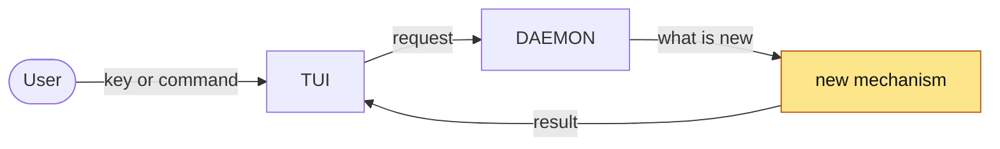

<!-- 01 · Benefit groups — the default. A feature PR with two to four things the user gets.
     Sections are named for the benefit, fixes file under the promise they keep. -->

<One or two sentences: what landed and why — the two things a reader must know before the diff.>

**Contents**
- [✨ What you get](#-what-you-get)
  - [🚀 <Benefit group one>](#-benefit-group-one)
  - [🔔 <Benefit group two>](#-benefit-group-two)
- [📸 Screenshots](#-screenshots)
- [🧭 How it flows](#-how-it-flows)
- [🔧 Technical overview](#-technical-overview)
- [📝 Notes](#-notes)

## ✨ What you get

### 🚀 <Benefit group one>

- **<Two-to-five-word hook>.** <What it does, in two or three sentences for someone who has not read the diff: the key or command in backticks, the setting in the `Settings › Sessions › done_sound` form, where it lives.>
- **<Hook>.** <…>

### 🔔 <Benefit group two>

- **<Hook>.** <…>
- **<A fix, filed here because this is the promise it keeps>.** <The cause in one clause, the new behaviour in the next.>

<!-- A group with one bullet merges into its neighbour. Two or three bullets per group. -->

## 📸 Screenshots

| <What this shows — the screen after the change> |
|---|
|  |

<!-- Captured with the SCREENSHOT HARNESS at 190x50; hosted on the pr-assets branch (skill step 4). -->

## 🧭 How it flows

<!-- Draw the change, not the system: ten to twenty nodes, the new node(s) given the `changed` class. -->

## 🔧 Technical overview

- **Mechanism.** <How it works, in three or four sentences: the type or flag added, who owns the state, what triggers it.>
- **Files.** `crates/<crate>/src/<file>.rs` — <one clause>; `crates/<crate>/src/<file>.rs` — <one clause>.
- **Not done.** <The approach rejected and why, so the reviewer does not ask "why not X".>
- **Gate.** `make ci` green — fmt, clippy, <N> tests. <Or: what did not run, and why.>

## 📝 Notes

- <Merge state: `origin/main` (vX.Y.Z) is merged in; conflicts and what they broke, or "none".>
- <Anything the user must do to upgrade — a PROTOCOL VERSION bump means `nebula kill` first.>
- Closes #<N>.

🤖 Generated with [Claude Code](https://claude.com/claude-code)

<the session link, only when the harness footer includes one — otherwise delete this line>
