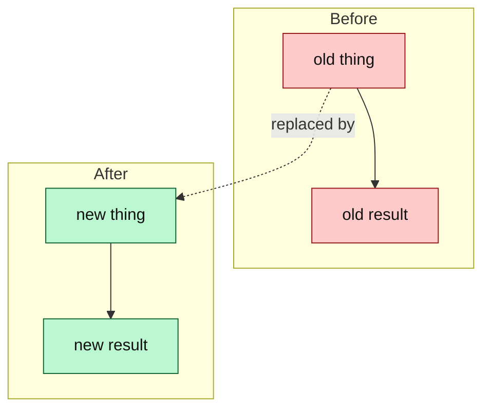

<!-- 02 · Before / After — the change replaces something visible: a layout, a key, a status colour.
     Every change is a row with both states; every screenshot is a pair. -->

<One sentence: what was replaced, and the one-clause reason.>

**Contents:** [🔁 Before / After](#-before--after) · [📸 Screenshots](#-screenshots) · [🧭 What moved](#-what-moved) · [🔧 Technical overview](#-technical-overview) · [📝 Notes](#-notes)

## 🔁 Before / After

| | Before | After |
|---|---|---|
| **<Thing one>** | <what it did — one clause> | <what it does now — one clause, the key in backticks> |
| **<Thing two>** | <…> | <…> |
| **<Thing three>** | <…> | <…> |
| **Unchanged** | <what the user liked and still has — say it, so the reviewer knows you kept it> | same |

## 📸 Screenshots

| Before | After |
|---|---|
|  |  |
|  |  |

<!-- The "before" shot comes from an origin/main build in the SCREENSHOT HARNESS; same size, same demo data, same cursor position. -->

## 🧭 What moved

## 🔧 Technical overview

- **What actually changed.** <The mechanism in three sentences; name the type, the flag, the function that moved.>
- **Files.** `crates/<crate>/src/<file>.rs` — <clause>; `crates/<crate>/src/<file>.rs` — <clause>.
- **Kept as-is on purpose.** <The behaviour the change stops short of, and why.>
- **Gate.** <`make ci` green — N tests; or what did not run and why.>

## 📝 Notes

- <Merge state and conflicts.>
- <Upgrade note, if any.>

🤖 Generated with [Claude Code](https://claude.com/claude-code)

<the session link, only when the harness footer includes one — otherwise delete this line>
