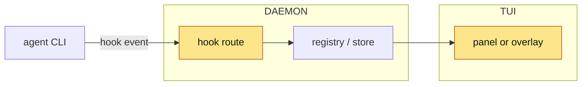

<!-- 03 · Category table — a mixed branch: features, fixes, docs, tests, refactors in one PR.
     The table at the top is the whole PR at a glance; each category section expands one row group. -->

<One or two sentences: the theme that ties the branch together, and the headline item.>

**Contents:** [📋 At a glance](#-at-a-glance) · [✨ Features](#-features) · [🐛 Fixes](#-fixes) · [📝 Docs](#-docs) · [🧪 Tests](#-tests) · [📸 Screenshots](#-screenshots) · [🧭 Diagram](#-diagram) · [🔧 Technical overview](#-technical-overview) · [📓 Notes](#-notes)

## 📋 At a glance

| | Category | Change | Where it shows |
|---|---|---|---|
| ✨ | Feature | **<hook>** — <one clause> | <panel, key or command> |
| ✨ | Feature | **<hook>** — <one clause> | <…> |
| 🐛 | Fix | **<hook>** — <symptom → now> | <…> |
| 📝 | Docs | **<hook>** — <what page changed> | `docs/<page>.md` |
| 🧪 | Tests | **<hook>** — <what is now covered> | `crates/<crate>/tests/<file>.rs` |
| ♻ | Refactor | **<hook>** — <no behaviour change; what moved> | `crates/<crate>/src/` |

## ✨ Features

- **<Hook>.** <Two or three sentences for someone who has not read the diff: key or command in backticks, the setting path, where it lives.>
- **<Hook>.** <…>

## 🐛 Fixes

- **<Hook>.** <The cause in one clause, the new behaviour in the next.> Fixes #<N>.

## 📝 Docs

- **<Hook>.** <Which of the DOCS PAGES, and what claim it now makes.>

## 🧪 Tests

- **<Hook>.** <What the new test proves; where it would have caught the old bug.>

## 📸 Screenshots

| ✨ <Feature one> | 🐛 <Fix, after> |
|---|---|
|  |  |

## 🧭 Diagram

## 🔧 Technical overview

- **Features.** <Mechanism, three sentences; files with a clause each.>
- **Fixes.** <Root cause and the one-line change; the regression test's name.>
- **Refactor.** <What moved where, and the proof nothing changed (same test count, a diff of the rendered output).>
- **Gate.** <`make ci` green — N tests; or what did not run and why.>

## 📓 Notes

- <Merge state, conflicts, upgrade note.>

🤖 Generated with [Claude Code](https://claude.com/claude-code)

<the session link, only when the harness footer includes one — otherwise delete this line>
