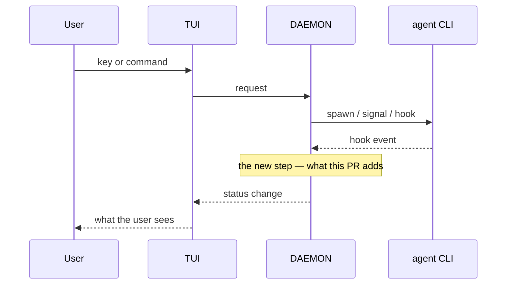

<!-- 04 · Story — one change with a strong why. Numbered sections read top to bottom:
     problem → change → how it looks → how it works → the details → notes. -->

<One sentence that names the problem and the fix together: "X made Y happen; now Z."> 

**Contents:** [1. The problem](#1-the-problem) · [2. What changed](#2-what-changed) · [3. How it looks](#3-how-it-looks) · [4. How it works](#4-how-it-works) · [5. Technical overview](#5-technical-overview) · [6. Notes](#6-notes)

## 1. The problem

<Two to four sentences, in the user's words where possible (the MEMORY LOG entry's **Asked** line): what they saw, when, why it mattered. No code yet.>

> <Optional: the user's own sentence, quoted.>

## 2. What changed

- **<Hook>.** <The new behaviour, the key or command in backticks.>
- **<Hook>.** <…>
- **Unchanged.** <What the user liked and still has.>

## 3. How it looks

| <Caption: what this shows> |
|---|
|  |

<!-- A before shot too, if the problem was visible: make it a two-column table. -->

## 4. How it works

## 5. Technical overview

- **Mechanism.** <Three or four sentences: the type or flag, who owns the state, what triggers it.>
- **Files.** `crates/<crate>/src/<file>.rs` — <clause>; `crates/<crate>/src/<file>.rs` — <clause>.
- **Why not <the obvious alternative>.** <One or two sentences.>
- **Gate.** <`make ci` green — N tests; or what did not run and why.>

## 6. Notes

- <Merge state, conflicts, upgrade note.>
- Closes #<N>.

🤖 Generated with [Claude Code](https://claude.com/claude-code)

<the session link, only when the harness footer includes one — otherwise delete this line>
