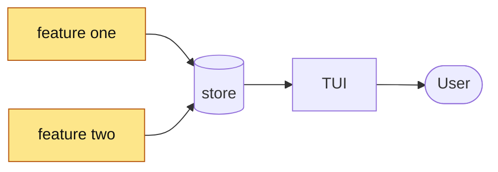

<!-- 05 · Release note — the PR is most of a release. The groups mirror the RELEASE NOTES the
     RELEASE SKILL writes, so the changelog can be lifted from the body when the tag is cut. -->

**This PR:** <the release in half a sentence, naming the headline items in the order the groups use.>

**Contents:** [🎁 Highlights](#-highlights) · [🚧 Heads up](#-heads-up) · [📸 Screenshots](#-screenshots) · [🧭 Diagram](#-diagram) · [🔧 Technical overview](#-technical-overview) · [📝 Notes](#-notes)

## 🎁 Highlights

### 🚀 <Benefit group — e.g. Launch faster>

- **<Hook>.** <Two or three sentences: key or command in backticks, the setting path, where it lives.>
- **<Hook>.** <…>

### 🔔 <Benefit group — e.g. Know when it's done>

- **<Hook>.** <…>
- **<A fix under the promise it keeps>.** <Cause in one clause, new behaviour in the next.>

### 🧭 <Benefit group — e.g. Lists that look after themselves>

- **<Hook>.** <…>

<!-- Reuse the RELEASE SKILL's group names when they fit: 🚀 Launch faster · 🔔 Know when it's done ·
     🧭 Lists that look after themselves · 🫥 Shape the screen · 🔌 Reach it from anywhere. -->

## 🚧 Heads up

<What the user must do to upgrade, one line: a PROTOCOL VERSION bump means `nebula kill` on the old daemon before the new TUI attaches. Delete the section when nothing needs them.>

## 📸 Screenshots

| 🚀 <group one> | 🔔 <group two> |
|---|---|
|  |  |

## 🧭 Diagram

## 🔧 Technical overview

- **<Group one>.** <Mechanism in three sentences; files with a clause each.>
- **<Group two>.** <…>
- **Protocol.** <PROTOCOL VERSION N → N+1 because <field added>; or "unchanged".>
- **Gate.** <`make ci` green — N tests; or what did not run and why.>

## 📝 Notes

- <Merge state, conflicts.>
- <Contributors: Thanks @handle (#NN).>

🤖 Generated with [Claude Code](https://claude.com/claude-code)

<the session link, only when the harness footer includes one — otherwise delete this line>
