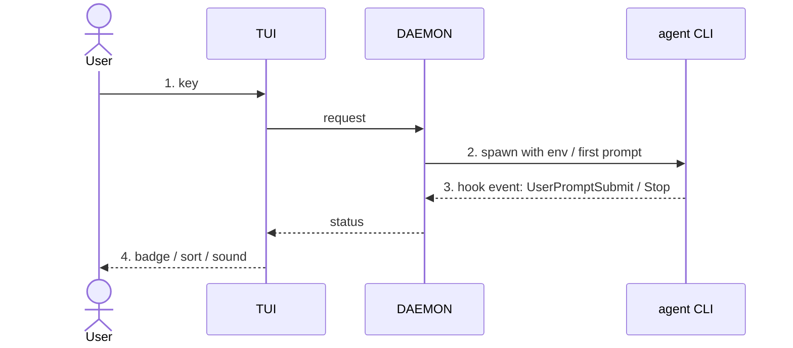

<!-- 06 · User journey — the change is a sequence of things the user does and sees.
     One numbered step per action, a screenshot per step, the diagram is the same sequence from the inside. -->

<One sentence: the journey this PR adds or changes, from the first key to the last screen.>

**Contents:** [🪜 The journey](#-the-journey) · [📸 Screenshots](#-screenshots) · [🧭 Under the hood](#-under-the-hood) · [🔧 Technical overview](#-technical-overview) · [📝 Notes](#-notes)

## 🪜 The journey

1. **You press `<key>`** in the <PANEL>. <What appears, one clause.>
2. **You <type / pick / confirm>.** <What the screen does, one clause.>
3. **The <SESSION / WORKTREE / …> <starts / moves / finishes>.** <The status you see and when.>
4. **You come back later.** <What has changed on screen without you — the badge, the sort, the sound.>

**Still the same:** <the parts of the flow the user already knows that did not move.>

## 📸 Screenshots

| Step 1 — <caption> | Step 2 — <caption> |
|---|---|
|  |  |
| **Step 3 — <caption>** | **Step 4 — <caption>** |
|  |  |

## 🧭 Under the hood

## 🔧 Technical overview

- **Step 1–2.** <Mechanism: the overlay or picker, the request type, three sentences; files with a clause each.>
- **Step 3–4.** <Mechanism: the daemon-side state, the hook route, the TUI field it feeds.>
- **Files.** `crates/nebula-tui/src/<file>.rs` — <clause>; `crates/nebula-daemon/src/<file>.rs` — <clause>.
- **Gate.** <`make ci` green — N tests, including the e2e that walks this journey; or what did not run and why.>

## 📝 Notes

- <Merge state, conflicts, upgrade note.>

🤖 Generated with [Claude Code](https://claude.com/claude-code)

<the session link, only when the harness footer includes one — otherwise delete this line>
