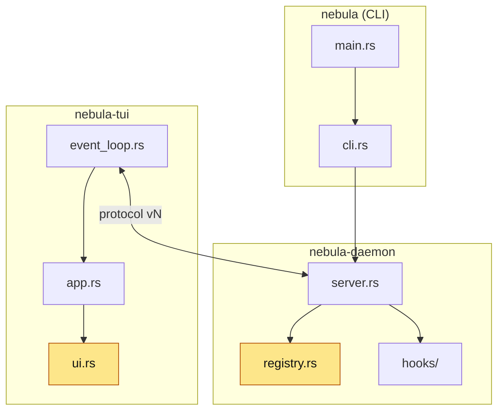

<!-- 07 · Collapsible — a big diff whose detail would bury the summary. Headings stay outside the
     
 blocks so the TOC links still resolve; only the bodies fold. -->

<Two sentences: what this PR is, and the one number that says how big (files, tests, a version).>

**Contents:** [🎯 Summary](#-summary) · [✨ Changes](#-changes) · [📸 Screenshots](#-screenshots) · [🧩 Architecture](#-architecture) · [🔧 Technical overview](#-technical-overview) · [📝 Notes](#-notes)

## 🎯 Summary

- **<Hook one>.** <One sentence.>
- **<Hook two>.** <One sentence.>
- **<Hook three>.** <One sentence.>

## ✨ Changes

🚀 <b>&lt;Change one&gt;</b> — &lt;one clause&gt;

<Two or three paragraphs or bullets, still high level: the key or command in backticks, what the user sees, what stayed the same.>

🔔 <b>&lt;Change two&gt;</b> — &lt;one clause&gt;

<…>

🐛 <b>&lt;Fix&gt;</b> — &lt;symptom → now&gt;

<The cause in one clause, the new behaviour in the next.> Fixes #<N>.

<!-- A blank line after 
 and before 
 is what makes GitHub render the markdown inside. -->

## 📸 Screenshots

| <Change one> | <Change two> |
|---|---|
|  |  |

## 🧩 Architecture

## 🔧 Technical overview

Mechanism, files, rejected approaches, gate

- **Mechanism.** <Three or four sentences per change.>
- **Files.** `crates/<crate>/src/<file>.rs` — <clause>; `crates/<crate>/src/<file>.rs` — <clause>.
- **Not done.** <The approach rejected and why.>
- **Gate.** <`make ci` green — N tests; or what did not run and why.>

## 📝 Notes

- <Merge state, conflicts, upgrade note.>

🤖 Generated with [Claude Code](https://claude.com/claude-code)

<the session link, only when the harness footer includes one — otherwise delete this line>
