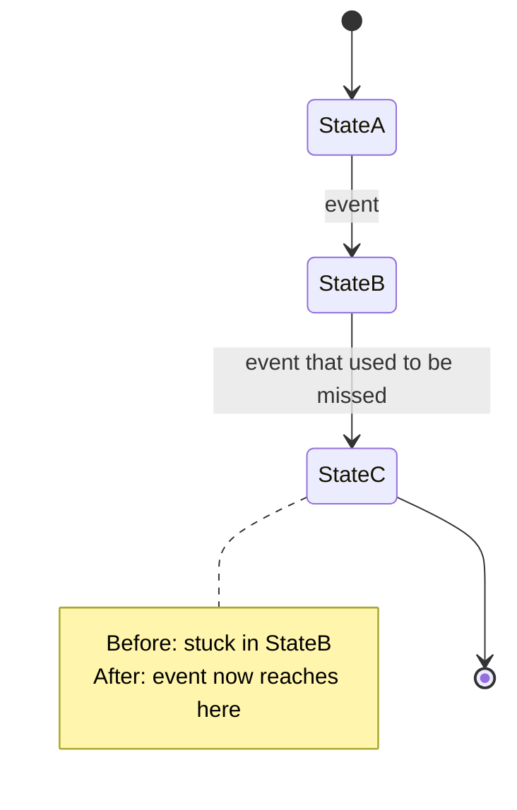

<!-- 08 · Bug fix — issue-driven. Symptom, cause, fix, proof, in that order; the pair of screenshots
     is the proof a reviewer can see without running anything. -->

Closes #<N>. <One sentence: what was wrong, and what is true now.>

**Contents:** [🐛 Symptom](#-symptom) · [🔍 Cause](#-cause) · [✅ Fix](#-fix) · [📸 Before / After](#-before--after) · [🔁 State](#-state) · [🔧 Technical overview](#-technical-overview) · [🧪 Proof](#-proof) · [📝 Notes](#-notes)

## 🐛 Symptom

<What the user saw, in their words (the issue title or the MEMORY LOG **Asked** line): the screen, the key, the terminal, the version. Two or three sentences.>

## 🔍 Cause

<The root cause in plain words, one paragraph: which value was wrong, since when, and why nothing caught it.>

## ✅ Fix

- **<Hook>.** <The new behaviour, one or two sentences.>
- **Unchanged.** <What around it was deliberately left alone.>

## 📸 Before / After

| Before (#<N>) | After |
|---|---|
|  |  |

## 🔁 State

<!-- Or a flowchart with the buggy edge in red and the fixed edge in green, when the bug is a wrong path rather than a missing transition. -->

## 🔧 Technical overview

- **The line that mattered.** `crates/<crate>/src/<file>.rs` — <what the old code did and what the new code does, two sentences>.
- **Why it was missed.** <The test gap or the environment difference.>
- **Why not <the obvious alternative>.** <One sentence.>

## 🧪 Proof

- **Regression test.** `<test_name>` in `crates/<crate>/src/<file>.rs` — fails on `origin/main`, passes here.
- **Gate.** <`make ci` green — N tests; or what did not run and why.>

## 📝 Notes

- <Merge state, conflicts, upgrade note.>

🤖 Generated with [Claude Code](https://claude.com/claude-code)

<the session link, only when the harness footer includes one — otherwise delete this line>
