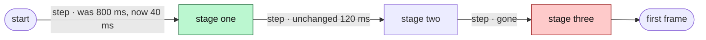

<!-- 09 · Scorecard — numbers tell the story: perf, size, test count, a protocol bump.
     Every number in the table comes from a command you ran on both sides; say which command. -->

<One sentence: what got faster, smaller or safer, with the headline number.>

**Contents:** [📊 Scorecard](#-scorecard) · [✨ What changed](#-what-changed) · [📸 Screenshots](#-screenshots) · [🧭 Where the time goes](#-where-the-time-goes) · [🔧 Technical overview](#-technical-overview) · [📝 Notes](#-notes)

## 📊 Scorecard

| Metric | Before | After | Δ | Measured with |
|---|---|---|---|---|
| <Startup to first frame> | <1.8 s> | <0.4 s> | **−78 %** | `<command>` |
| <Idle RSS, daemon> | <610 MB> | <90 MB> | **−85 %** | `ps -o rss` |
| Tests | <631> | <687> | +56 | `cargo test --workspace` |
| Lines (net) | | | <+846 −346> | `git diff --stat origin/main` |
| PROTOCOL VERSION | <31> | <32> | +1 | `nebula_core::protocol` |

## ✨ What changed

- **<Hook>.** <What the user gets, one or two sentences; the key, command or setting in backticks.>
- **<Hook>.** <…>
- **Unchanged.** <What the user liked and still has.>

## 📸 Screenshots

| <Caption: the screen after the change — or the FOOTER showing the new number> |
|---|
|  |

## 🧭 Where the time goes

<!-- Or `pie showData` of the diff by crate when the story is where the code moved, not how long it takes. -->

## 🔧 Technical overview

- **Mechanism.** <Three or four sentences: what was cached, skipped, batched or moved, and who owns it now.>
- **Files.** `crates/<crate>/src/<file>.rs` — <clause>; `crates/<crate>/src/<file>.rs` — <clause>.
- **How the numbers were taken.** <Machine, build profile, the exact command, how many runs.>
- **Gate.** <`make ci` green — N tests; or what did not run and why.>

## 📝 Notes

- <Merge state, conflicts.>
- <A PROTOCOL VERSION bump means `nebula kill` on the old daemon before the new TUI attaches.>

🤖 Generated with [Claude Code](https://claude.com/claude-code)

<the session link, only when the harness footer includes one — otherwise delete this line>
