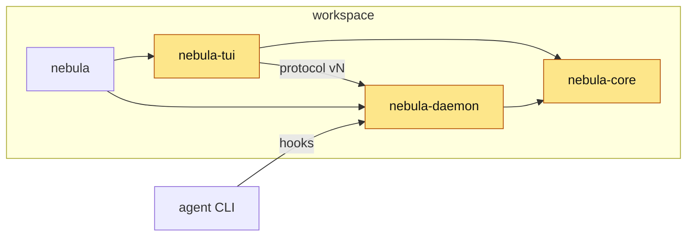

<!-- 10 · Crate map — the change spans the workspace. Organise by where it lives; the diagram is
     the workspace with the touched crates lit up. -->

<Two sentences: what landed across the workspace, and the one place a reviewer should start.>

**Contents:** [📦 By crate](#-by-crate) · [🧩 Workspace map](#-workspace-map) · [📸 Screenshots](#-screenshots) · [🔧 Technical overview](#-technical-overview) · [📝 Notes](#-notes)

## 📦 By crate

### 🧱 nebula-core

- **<Hook>.** <The type, flag or protocol field, and what it means for the user, one sentence.>

### ⚙ nebula-daemon

- **<Hook>.** <What the DAEMON now does, the hook route or mechanism in backticks.>
- **<Hook>.** <…>

### 🖥 nebula-tui

- **<Hook>.** <What the user sees, the key in backticks, the panel it lives in.>

### 💻 nebula (CLI)

- **<Hook>.** <The subcommand or flag, `nebula `, and what it prints.>

### 📚 docs / memory

- **<Hook>.** <Which of the DOCS PAGES or which MEMORY LOG entry changed.>

## 🧩 Workspace map

<!-- Give the `changed` class to every crate the diffstat names; leave the rest plain. -->

## 📸 Screenshots

| <Caption: what the TUI shows after the change> |
|---|
|  |

<!-- A pure daemon/core change: a fenced block of the terminal output instead, plus one line on why there is no PNG. -->

## 🔧 Technical overview

- **nebula-core.** `crates/nebula-core/src/<file>.rs` — <clause>. <PROTOCOL VERSION N → N+1, or "unchanged".>
- **nebula-daemon.** `crates/nebula-daemon/src/<file>.rs` — <clause>; `…/<file>.rs` — <clause>.
- **nebula-tui.** `crates/nebula-tui/src/<file>.rs` — <clause>.
- **nebula.** `crates/nebula/src/<file>.rs` — <clause>.
- **Not done.** <The approach rejected and why.>
- **Gate.** <`make ci` green — N tests; or what did not run and why.>

## 📝 Notes

- <Merge state, conflicts.>
- <Upgrade note: `nebula kill` first when the PROTOCOL VERSION moved.>

🤖 Generated with [Claude Code](https://claude.com/claude-code)

<the session link, only when the harness footer includes one — otherwise delete this line>
