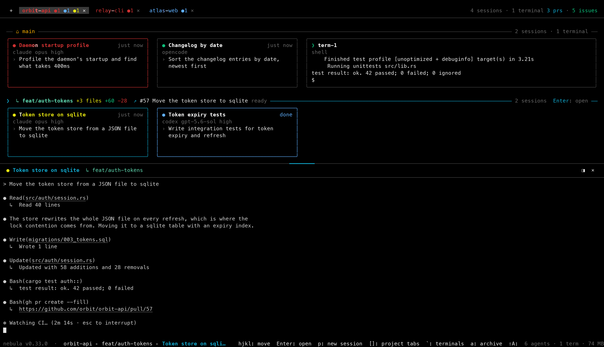
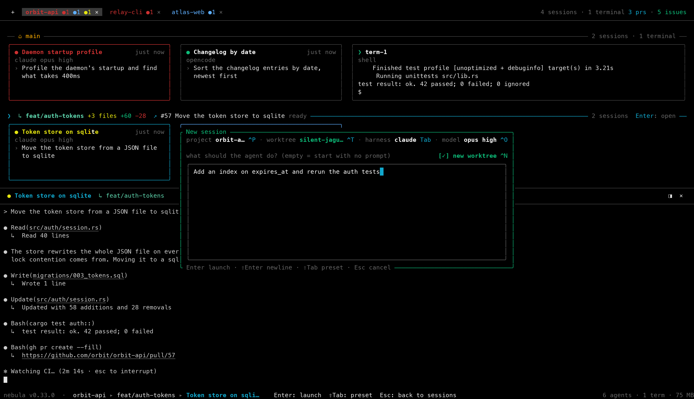
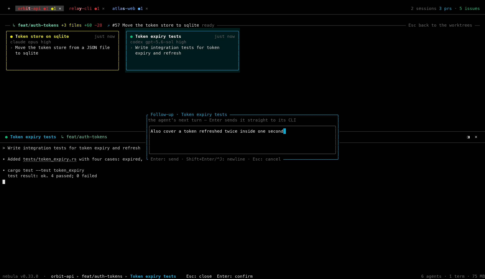
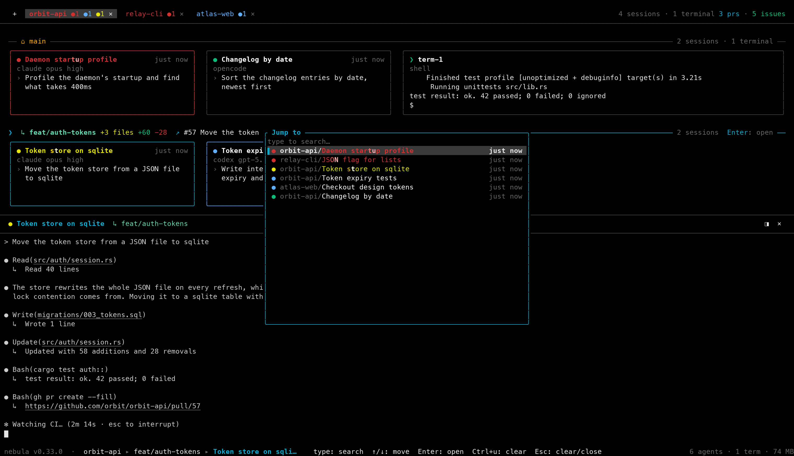

> [!WARNING]
> **Work in progress.** nebula is built for one person's workflow — mine — and it changes fast as I iterate on it.
> Expect breaking changes between releases: keys that move, screens that get redrawn, features that come and go
> without notice. If it's close to what you want, fork or clone it and bend it into what you need it to be.

<div align="center">

*"Whatever you do, work heartily, as for the Lord and not for men."* — Colossians 3:23 (ESV)

# nebula

**Mission control for your coding agents.**

Run **Claude Code**, **Codex**, **Cursor**, **Pi**, **Muse**, **Grok Build** and **OpenCode** across every project and git WORKTREE you own — from one
terminal, one keyboard, one grid. They keep working when you close it.

[](https://github.com/AgentSystemLabs/nebula/releases)
[](https://github.com/AgentSystemLabs/nebula/actions)
[](LICENSE)
[](#install)
[](https://www.rust-lang.org)

[**Keys**](docs/keys.md) · [**Commands**](docs/commands.md) · [**Sessions**](docs/sessions.md) · [**Configuration**](docs/configuration.md) · [**How it works**](docs/how-it-works.md)

```sh
curl -fsSL https://raw.githubusercontent.com/AgentSystemLabs/nebula/main/install.sh | sh
```



</div>

---

## Three agents, three tabs, and no idea which one needs you

You start three agents in three terminal tabs. Five minutes later you don't know which one is waiting on
a permission prompt, which one finished, and which one is still thinking — so you tab through all three,
every time, and read the screens. Start a fourth and you aren't running more agents, you're doing a worse
job of watching the ones you have.

nebula replaces the reading with a grid and a color. Every SESSION is a CARD — its name, what it runs on,
the last thing you asked it — with a STATUS DOT that says what it's doing; the cards sit in a BAND per
checkout under a row of PROJECT TABS, and every tab carries its sessions' dots with a count, so a red `●1`
on a tab tells you exactly where to look without opening anything.

**No Electron, no browser, no server, no MCP.** One Rust binary (a 5 MB download) and a unix socket.

## What you get

| | |
|---|---|
| **One grid, every session** | PROJECT TABS across the top, a BAND per WORKTREE, a CARD per SESSION, and the PANE — the live terminal of the card under the cursor — along the bottom or down the right. Terminals are cards too, two columns wide, showing the last lines their shell printed. `j`/`k` walk the bands, `Tab` opens one in place, `h`/`l` walk its cards, `Enter` steps into the pane and starts typing at the agent, `` Ctrl+` `` hands the keys back. |
| **A DAEMON that owns the PTYs** | Quit the TUI, shut the laptop, come back tomorrow. The agents never stopped, and the SCROLLBACK RING is replayed on ATTACH. |
| **STATUS DOTS you read instead of screens** | ● yellow mid-turn, ● blue finished and UNSEEN, ● green finished and read, ● red waiting on you — on every card, and counted on every PROJECT TAB (`orbit-api ●1 ●1 ●1`), so a project you aren't looking at still tells you what it owes you. A finish you haven't read wears a blue `done` badge until you do. |
| **A task box, not a picker** | `p` opens the QUICK PROMPT: type the task, `Enter`, and an agent is working on it. The row over the box spells out the launch — `project orbit-api ^P · worktree main ^T · harness claude Tab · model opus high ^O` — and each of those is a picker you can open without losing the text. `Space` on a card is the same box for a session already running: its next turn, sent straight down its PTY, without stepping into it. |
| **Real git WORKTREES, one keystroke** | `Ctrl+N` in the box flips the launch onto a fresh `git worktree` — the frame turns green and names the branch it will cut — and every card in that checkout sits in its own BAND, with the branch, its uncommitted changes and its pull request on the rule above them. Two agents in two directories never collide. A WORKTREE HOOK in git config lets a project claim a port or a route when a checkout is created and release it when it is deleted. |
| **The root checkout on any branch, no shell** | `c` on a root-branch card lists every branch and remote branch, fuzzy-filtered as you type; `Enter` switches, or creates the branch when nothing matches. Uncommitted changes? The BRANCH SWITCHER asks first — stash them, bring them along, commit them, or discard them — the way an IDE would. |
| **Agents that drive nebula back** | Tell a Claude SESSION *"do this in a worktree"* and it runs `nebula worktree`, then restarts itself resumed inside the new checkout. Say *"show me the file"* and `nebula open` puts it in front of you in a tabbed modal. Say *"start a new nebula session that…"* and `nebula spawn` has a second agent working beside it before you look. |
| **Every open pull request, in place** | nebula asks `gh` what's open on the repo. A band whose branch has a pull request names it on its rule — `↗ #57 Move the token store to sqlite  ready` — in red once GitHub says it no longer merges or a check failed, purple once it's merged; the header counts `3 prs · 5 issues`. `v` lists them and reads the one under the cursor — description, checks, the whole conversation — `Ctrl+g` for its diff, `Ctrl+c` to comment without leaving the keyboard, `Enter` for a PR SESSION in the pull request's own checkout, `Shift+V` on a card sends its pull request to the browser. |
| **Every open issue, one key from an agent** | `i` lists the project's open GitHub issues, newest first, filtered as you type, and reads the one under the cursor — description, labels, comments. `Enter` opens the QUICK PROMPT for it, `Shift+Tab` launches one of your AGENT PRESETS on it, `Ctrl+e` edits its title and description in place; the issue's URL travels with the session as context on every spawn, so the harness knows what it is fixing. `Shift+I` on the card opens the issue it came from. |
| **Diff, find, grep, browse** | `g` opens the DIFF VIEWER with REVIEWED MARKS, `f` the FILE FINDER, `F` a `git grep`, `b` the TREE BROWSER — all scoped to the card's WORKTREE, all one key from anywhere. Markdown previews are rendered pages, not raw `#` and `*`. |
| **`/` finds anything, anywhere** | The PALETTE spans every PROJECT on the machine, each session listed with its project in front of it. Before you type it is that overview, sorted by attention: NEEDS FEEDBACK first, then RUNNING, then UNSEEN — so `/` `Enter` is the fastest way back to whatever needs you, and `.` / `,` cycle that same attention order with no modal at all, one session per press, every project included. Open pull requests are rows too. |
| **It follows you to other machines** | `nebula ssh <host>` opens nebula there, installing it if missing. `nebula tunnel <host>` puts that machine's TUI in a browser tab over a single ssh tunnel. Your settings and agent presets go along, and `nebula config export` / `import` back them up. |

## Supported harnesses

Seven CLIs work out of the box, each with its own Agents tab section and model/effort rows. Install the CLI,
pick it in the box's `Tab` picker, done. A CLI missing from PATH still shows in the picker; the DAEMON
re-checks through the login shell at launch.

| | Harness | CLI | Install |
|---|---|---|---|
|  | [Claude](https://code.claude.com/docs/en/setup) | `claude` | `curl -fsSL https://claude.ai/install.sh \| bash` |
|  | [Codex](https://github.com/openai/codex) | `codex` | `npm i -g @openai/codex` |
|  | [Cursor](https://cursor.com/install) | `cursor-agent` | `curl -fsSL https://cursor.com/install \| bash` |
|  | [Pi](https://pi.dev) | `pi` | `curl -fsSL https://pi.dev/install.sh \| sh` |
|  | [Muse](https://developer.meta.com/ai/lp/muse-code) | `muse` | `curl -fsSL https://dev.meta.ai/install.sh \| bash` |
|  | [OpenCode](https://opencode.ai/docs/) | `opencode` | `curl -fsSL https://opencode.ai/install \| bash` |
|  | [Grok](https://github.com/xai-org/grok-build) | `grok` | `curl -fsSL https://x.ai/cli/install.sh \| bash` |

## Install

macOS or Linux — the same command installs and updates:

```sh
curl -fsSL https://raw.githubusercontent.com/AgentSystemLabs/nebula/main/install.sh | sh
```

It downloads the prebuilt binary for your platform from the latest GitHub release into `~/.local/bin`
(override with `NEBULA_INSTALL_DIR`), falling back to `cargo install --git` when no release matches.
Afterwards, `nebula upgrade` runs that same script for you; it refuses to clobber a local `cargo build`
(pass `--force` if you mean it). Upgrading with a DAEMON running is safe: an idle one — nothing live in
it — is shut down for you, so the next launch comes up on the new binary. A DAEMON with live SESSIONS is
left alone and they keep running the old binary until you `nebula kill` and relaunch — unless the new
build speaks a different protocol, in which case it can't attach until that restart, and `nebula upgrade`
says so and offers to do it for you. `nebula --version`
(`-V`) says which binary you are on.

> **Prerequisite:** at least one agent CLI on your `PATH` — `claude`, `codex`, `cursor-agent`, `pi`, `muse`, `grok`, or `opencode`.
> nebula spawns them; it doesn't ship them.
>
> Three commands each want one more binary, and only those commands: `nebula ssh` and `nebula tunnel`
> exit if there is no OpenSSH client (`ssh`), and `nebula browser` needs `ttyd` on your `PATH` — for
> `nebula tunnel` it is the *remote* host that needs it. The TUI itself needs neither.

## Quickstart

**1. Add a repo.** nebula is project-first, and a PROJECT is just a git checkout:

```sh
nebula add ~/code/my-app       # or, from inside the repo: nebula add .
```

**2. Open the TUI.** A bare `nebula` launches it and auto-starts the DAEMON:

```sh
nebula
```

It opens on the GRID — no modal, ever, on launch. With no PROJECTS yet you get the SPLASH: launched from
inside a repo, `Enter` opens it as your first PROJECT, so step 1 is optional — anywhere else, `o` browses
for one without leaving the TUI. Every project you open gets a PROJECT TAB in the header, the one you
last worked in at the far left: a click, `[` / `]`, or a digit `1`–`9` switches, `+` drops a list of every
project on the machine, and `x` closes a tab without touching its sessions.

**3. Start the agent.** `p` opens the QUICK PROMPT, focused, so the first thing you type is the task.
`Enter` launches it — with the harness, model and effort the Agents tab defaults name, in the checkout
under the cursor — and the new card shows up in the grid with its terminal in the pane. For one launch
only, `Tab` picks another harness (**Claude**, **Codex**, **Cursor**, **Pi**, **Muse**, **Grok Build** or **OpenCode**, `→`
for MODEL and EFFORT), `Ctrl+O` a model, `Ctrl+T` any checkout of the project, `Ctrl+P` any project on the
machine (a launch aimed elsewhere runs in the background and the footer says where it went). Send the
box empty and the CLI starts bare, its pane yours to type the first prompt into. Save a framing you
keep retyping as an AGENT PRESET (`e`) and it becomes one keystroke; a plain shell is `t`.

<div align="center"></div>

**4. Pick where it runs.** Press `Ctrl+N` inside the box and the launch goes into a real `git worktree`
cut for the job — the frame turns green and names the branch — or turn on `New worktree` under
**Quick prompt** in Settings → Agents to make that every box's default. That's the whole point of
the BANDS: two agents in two WORKTREES edit two directories and never collide, and each band's rule
carries the branch, its uncommitted changes (`+3 files +60 -28`) and its pull request.

**5. Read the grid, not the screens.** `j` / `k` walk the bands and the pane reads each checkout's
session as you pass; `Tab` opens a band to walk its cards, and `Enter` on a card steps into the pane
with the grid still up — `Ctrl+q` or `` Ctrl+` `` hands the keys back. `Space` on a card opens a
small box for that session's next turn and sends it without opening the session, so a wall of agents
gets its next instructions one card at a time.

<div align="center"></div>

**6. Walk away.** `q` asks first — a CONFIRM DIALOG reading *Leave the TUI? Sessions keep running in the
daemon.* that `Enter` accepts and a second `Ctrl+C` walks straight through. The DAEMON still owns every
PTY — come back with `nebula` an hour later and each SESSION is exactly where you left it, scrollback
replayed.

A new SESSION starts on a default name and AUTO-TITLE renames it from your first prompt — `Fix Login
Redirect`, not `agent-3`; `r` renames it whenever you like. A Claude SESSION's own name
is the same name: `/rename` inside Claude Code retitles the card, and a name set in nebula reaches
Claude's prompt box and `/resume` picker on your next prompt.

## Read the dots, not the screens

| Dot | AGENT STATUS |
|---|---|
| ● gray | FRESH — agent never run |
| ● yellow | RUNNING — turn in progress (the STOP GATE holds it open while subagents are live) |
| ● blue | UNSEEN — turn complete and nobody has looked at it yet |
| ● green | FINISHED — the same finished turn, once the cursor has been on the SESSION |
| ● red | NEEDS FEEDBACK — permission prompt or question waiting on you |
| ● magenta | terminated — process died mid-run |
| ○ | disconnected — the DAEMON restarted while the agent was live |

A Cursor SESSION never goes red: nebula runs `cursor-agent --force` and Cursor reports no permission
event, so waiting-on-you is not detectable there. A Muse SESSION never goes red either yet: `muse`
has no managed hooks, so its status is process-based until a hook dialect is mapped. Grok Build also uses process-based status,
with no managed hooks or automatic capture of its session ID yet. Model and effort IDs can be
set through `harnesses.grok` in config.json; the CLI supplies their defaults when unset. An OpenCode
SESSION does go red: nebula passes no `--auto`, so `opencode` keeps its own permission prompts, and its
managed plugin reports each one (and each `question` the agent asks you) as it opens and closes.

The PROJECT TABS ROLL UP their sessions: each tab carries one dot per state its sessions are in, with
the count and no word at all — red waiting on you, blue finished unread, yellow mid-turn, in that order
and left out where a state is empty — so a quiet project is its bare name, and a `●2` in red on a tab
you aren't looking at is the whole message.

A dot going blue while you were looking elsewhere is easy to miss, so nebula marks the moment and then
keeps count. The moment: a card's name sweeps — a bright band crossing it — in yellow while it runs and in
red while it waits on you, for as long as either lasts; a turn that finishes unread sweeps blue for about
five seconds and then holds still, and the project's tab name sweeps in the loudest of its sessions'
colors. Motion means live, or just changed; a card at rest is at rest (`animations` off stills all of
it). The count: a turn that finishes in a pane that isn't on screen puts a blue `done` badge on its
card where the age normally sits, and the tab's blue dot counts every one still owed a look. Landing the
cursor on a card previews it, which reads it: the badge comes down as you arrive and the tab's count
with it — `.` walks you onto the next one owed a look without hunting for it, every project included.
The flag lives in the DAEMON, so it survives closing the TUI and is shared by every client; a turn that
finishes in the pane you're already looking at never counts.

<div align="center"></div>

A dot going red is the one you can't afford to miss — a blocked agent burns the clock while you're in
another window — so that one reaches you: the FEEDBACK SOUND rings (`Sosumi` by default, distinct from
the `Glass` DONE SOUND a finish gets), and when the terminal window is in the background a desktop
notification names the session and its worktree. Neither fires for the pane you're locked into typing
at with the window focused — that prompt is already under your hands. One setting, `feedback_sound`,
owns both; `off` silences the pair. See [Configuration](docs/configuration.md).

## Where the status actually comes from

nebula doesn't poll the agents and it doesn't guess from the screen. At spawn it merges MANAGED HOOKS
into the WORKTREE's `.claude/settings.local.json`, `.cursor/hooks.json` or `~/.codex/hooks.json` — tagged
`_nebulaManaged`, your own hooks preserved, rebuilt every spawn — and each one is a fail-soft `curl` to
the DAEMON's loopback HOOK RECEIVER, authenticated with a per-boot BEARER TOKEN. Pi has no shell hooks,
so it gets one managed extension at `~/.pi/agent/extensions/nebula.ts` that posts the same events, and
OpenCode gets one managed plugin at `~/.config/opencode/plugins/nebula.ts` that does the same. For the one event no CLI
reports — a turn you cancelled with `Esc` — the PROGRESS SCANNER reads the CLI's own OSC 9;4 progress
escapes straight off the PTY, a signal that survives the cancel and stays busy while a permission prompt
is open.

## Teach nebula a new agent CLI

The seven built-ins are just rows in a table, and the table is open. One block in `config.json` adds
a CLI everywhere at once: the box's `Tab` picker, the `e` presets, spawn, resume, and the Agents tab, which
grows it a section to tune without hand-editing.

```json
{
  "harnesses": {
    "mycli": {
      "program": "mycli",
      "model_flag": "--model",
      "model_default": "large",
      "hooks": "claude"
    }
  }
}
```

`program` is the only required row: the binary nebula launches, resolved on PATH through your login
shell. A new id starts enabled, takes the id as its label, boots fresh every launch (no resume), and
hides the Effort row until you map effort. `nebula config harnesses` prints the effective rows to copy
from, and a block that stops making sense refuses its launches with the reason while everything else
keeps working. Ids use lowercase letters, digits and hyphens, and must not collide with a built-in.

`hooks` names a built-in dialect, not your own scripts: `claude`, `codex`, `cursor`, `pi` or `opencode`. At spawn
nebula installs that dialect's MANAGED HOOKS for the session (the same `.claude/settings.local.json`,
`.cursor/hooks.json`, `~/.codex/hooks.json`, pi extension or OpenCode plugin the built-in gets), so a CLI that speaks
that protocol reports status, prompts and permission waits exactly like the real thing. A
Claude-compatible CLI with `"hooks": "claude"` even gets title sync and auto-title. Leave `hooks` out
and the sessions stay process-based: running while the PTY is live, never red. Either way your own
hooks are preserved (nebula's entries are tagged `_nebulaManaged`) and the merge is rebuilt every
spawn.

One boundary to know: `nebula ssh` syncs `config.json` to the remote, but exec-capable harness keys
never travel with it: each machine runs only the programs its own files name. Full row reference
(resume styles, effort mapping, system-prompt passing, clearing a row with `null`): [Configuration](docs/configuration.md),
"The harness registry".

## Documentation

| | |
|---|---|
| [**Keys**](docs/keys.md) | Every default binding, the grid's own keys (tabs, bands, cards, the pane), the WORKTREE views (`g` `f` `F` `b` `i` `v`), the chips and readouts, and the mouse. All of it rebindable. |
| [**Commands**](docs/commands.md) | The `nebula` CLI: `add`, `rename`, `worktree`, `spawn`, `open`, `config`, `ssh`, `tunnel`, `browser`, `daemon`, `kill`, `upgrade`. |
| [**Sessions**](docs/sessions.md) | The QUICK PROMPT and the GRID, the NEW SESSION PICKER, MODEL / EFFORT, Claude Cloud and the CLOUD SESSION PANEL, AGENT PRESETS, the FOLLOW-UP COMPOSER, RECENT PROMPTS, the ISSUES MODAL, the PULL REQUESTS MODAL. |
| [**Configuration**](docs/configuration.md) | `config.json` and `config.local.json`, backup and restore, the SETTINGS OVERLAY, the HOTKEYS TAB, the `.nebula.json` PROJECT FILE (**Run** and **Open** in the project's menu, `Shift+Enter` opens it), compatibility rules, logs and environment overrides. |
| [**How it works**](docs/how-it-works.md) | The DAEMON, the hook dialects, AUTO-TITLE, WORKTREE RELOCATION, prewarm and reaping, persistence. |
| [**Architecture**](ARCHITECTURE.md) | Process model, the IPC CODEC and the crate layout. |

## Building

```sh
cargo build --release     # → target/release/nebula (~11 MB)
cargo test                # unit + end-to-end suite (spawns real daemons/PTYs)
```

`nebula-core` (shared protocol/entities), `nebula-daemon` (PTYs, SQLite, HOOK RECEIVER, STATUS MACHINE),
`nebula-tui` (ratatui client), `nebula` (the binary). `vendor/vt100` is a patched copy of the terminal
parser wired in through `[patch.crates-io]`: rows scrolled out of a top-anchored scroll region go to the
SCROLLBACK RING instead of being discarded, so wheel-up over a codex SESSION has something to show.

Screenshots: `make shot SCENE=readme-grid` renders the README's hero from a scripted demo — an isolated
nebula, stand-in agents, a stub `gh` — into `design-screenshots/`; the scenes live in `scripts/shot/scenes/`.

Releases: push a `v*` tag (`git tag v0.1.0 && git push --tags`) and CI builds mac (arm/intel) and linux (x64/arm64, static musl) binaries and
attaches them to a GitHub release — which is what `install.sh` downloads.

Pull requests: a branch pushed to this repository gets an automated Claude code review on its PR, as
inline comments. A PR from a fork does not — GitHub withholds the credentials the reviewer needs from a
fork's workflow runs — so a maintainer reviews it by hand, or asks for the review with `@claude` in a
PR comment.

## License

MIT — see [LICENSE](LICENSE).

<div align="center">
<br>
<sub>If nebula saves you a tab, a ⭐ helps other people find it.</sub>
</div>
