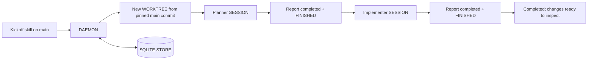

# Ordered AGENT workflows (prototype)

Start a task from the ROOT WORKTREE on `main`. NEBULA creates one separate WORKTREE and
runs the configured AGENTS in order. Both planner and implementer use the exact model ID
`claude-sonnet-5` with medium effort. A reviewer is another entry in the same ordered list.

Runtime state belongs to the **SQLITE STORE**. `.nebula/workflow.json` is the versioned
definition: provider, MODEL / EFFORT, instructions, order, and timeout. At kickoff the CLI
resolves NEBULA's configured defaults and the DAEMON freezes that definition into the run.
Editing the file afterwards affects new runs only. Remaining null defaults are delegated
to the provider CLI, so set explicit values when reproducibility matters.

MAKE DEV's initial database seed removes workflow runs and their SESSION associations,
alongside live SESSIONS. It publishes the seed only after cleanup succeeds; development
instances must never execute copied production workflows.



## Try it

This requires the prototype binary and DAEMON, PROTOCOL VERSION 39. The installed release
does not gain these commands until rebuilt. Test without replacing the live DAEMON:

1. Run the following from this checkout in a separate terminal. These dedicated paths avoid
   stopping an existing MAKE DEV instance for this checkout. Provider authentication and
   hooks still use your normal provider configuration.
2. Add this checkout as a PROJECT if absent, open an AGENT in its ROOT WORKTREE on `main`,
   and invoke `/workflow-prototype <task>`. The skill is under `.claude/skills` and linked
   into `.agents/skills` for both harnesses.
3. Inspect the new WORKTREE and SESSIONS in the TUI. Read `workflow status <run-id> --json`
   for the task, frozen definition, stage SESSION ids, and stored results.

```sh
make dev SEED=0 \
  DEV_RUNTIME=/tmp/nebula-workflow-prototype \
  DEV_DATA="$HOME/.nebula-dev/workflow-prototype"
```

Inside the development instance, use the absolute path to this checkout's
`target/debug/nebula` if `nebula` on PATH is the older installed release. The worker
STARTING PROMPTS already use the DAEMON executable's absolute, shell-quoted path. The
development runtime/data environment inherited by the SESSION selects the correct instance.
For example, from a kickoff SESSION whose working directory is this checkout:

```sh
./target/debug/nebula workflow start "Document the README setup steps" \
  --definition .nebula/workflow.json
```

The new WORKTREE starts from the committed `main` revision. Uncommitted changes in the
ROOT WORKTREE, including this prototype's source, are not copied there. The running
DAEMON supplies the workflow instructions and stores the definition, so workers do not
need a copy of the kickoff skill or configuration to participate.

## Configure AGENTS

Edit [the definition](../.nebula/workflow.json). `kind` accepts `claude` or `codex` in this
prototype; `model` and `effort` are strings understood by the selected provider through
NEBULA's existing launch code. Null values use NEBULA defaults. Invalid or unavailable
provider/model combinations stop the run through the ordinary SESSION failure path.

The list supports 1 to 10 unique stage ids and a timeout of 10 to 86,400 seconds per
stage, including time waiting for feedback. To add the third AGENT, append:

```json
{
  "id": "reviewer",
  "kind": "claude",
  "model": null,
  "effort": null,
  "instructions": "Read the task, plan, implementation result, and diff from the recorded base commit. Review correctness and verification. Report completed with evidence when acceptable, or blocked with specific findings. Leave product code unchanged."
}
```

A reviewer rejection blocks the workflow. Automatic review/fix loops and parallel stages
are outside this prototype. All stages share the same WORKTREE and see previous edits;
each receives a fresh SESSION and reads previous results from the SQLITE STORE.

## Commands

All accept `--json`. [The complete existing CLI reference](commands.md) covers the rest
of NEBULA; every visible command and subcommand also has its own `--help` page.

| Command | Behavior |
|---|---|
| `workflow start "task"` | Create a WORKTREE from `main`, freeze the definition, queue the first AGENT. Supports `--task-file` and `--definition`. Requires a kickoff SESSION in the ROOT WORKTREE. |
| `workflow status [id]` | Read one run; omitted id selects the caller's assigned workflow. JSON includes full artifacts. |
| `workflow list` | Show the 50 most recently updated runs across this DAEMON. |
| `workflow report --stage ID --outcome completed --file FILE --summary TEXT` | Store the current assigned AGENT's result and a copy of its Markdown file, maximum 64 KiB. |
| `workflow report --stage ID --outcome blocked --summary TEXT` | Record a blocker; an artifact is optional. |
| `workflow pause ID` | Stop scheduling; leave the current SESSION running. |
| `workflow resume ID` | Continue a paused/blocked run after resolving the cause; renew the stage timeout. |

JSON replies are `{"Run": {...}}` or `{"List": [...]}`. These are prototype interfaces.
The commands operate through the same local IPC trust boundary as other NEBULA commands.
Caller SESSION ids identify assignments; they are not a security boundary against another
process running as the same local user.

## State and recovery

MIGRATION 24 adds `workflow_runs` and `workflow_sessions` to the existing SQLITE STORE.
The first holds a complete JSON snapshot plus indexed active/update fields. The second
maps each assigned SESSION to exactly one run. One SQLite transaction writes both, so
an association conflict rolls back the complete checkpoint. Artifacts are stored as text
inside the snapshot, not as paths that disappear with a WORKTREE.

The DAEMON watcher runs every two seconds. A mutex serializes workflow commands and
watcher transitions. It records WORKTREE creation intent and stage launch intent before
external work, then records the resulting ids. Run states are `creating`, `running`,
`waiting`, `paused`, `blocked`, and `completed`; stage states are `pending`, `launching`,
`running`, and `completed`.

| Situation | Result and recovery |
|---|---|
| SESSION becomes FINISHED without a report | Wait for an explicit result; timeout eventually blocks. |
| AGENT reports completed while still RUNNING | Store the report and wait for FINISHED before handoff. |
| AGENT needs permissions or feedback | Show `waiting`; resolve the prompt in that SESSION. Normal provider permission behavior is preserved. |
| AGENT reports blocked | Stop scheduling. Resolve it in the same SESSION, replace its blocked report with completed, finish the turn, and resume. |
| DAEMON restarts during active work | Preserve ids, definition, and artifacts. A stopped SESSION blocks; reopen the existing SESSION in the TUI, inspect its task with status, continue it, and resume. |
| Restart after a completed report and FINISHED | That durable completion can advance without recreating the prior SESSION. |
| Crash during stage launch | Adopt the unique SESSION matching the recorded run/stage name. Zero or multiple matches block for inspection; no automatic replacement is launched. |
| Crash during WORKTREE creation | Keep the recorded branch/base and block for inspection; do not blindly retry creation. |
| WORKTREE or SESSION deleted, archived, relocated, or unavailable | Block with the specific cause. Historical results survive ordinary entity deletion. |

The watcher resumes scheduling after a DAEMON restart; it does not automatically resume
an interrupted provider conversation. This avoids duplicate implementation work when
completion is uncertain. A pause is a scheduling control, not a kill switch. Completed
reports are immutable; a duplicate report is accepted while that stage is still current.
No workflow automatically commits, merges, deploys, or deletes the resulting WORKTREE.

## What NEBULA already provided

The DAEMON already owned PTYs, the SQLITE STORE, WORKTREE creation, SESSION creation,
provider-specific MODEL / EFFORT arguments, STARTING PROMPTS, and status hooks. The TUI
is a client and can close while the DAEMON continues.

`nebula worktree` relocates the caller's existing SESSION. `nebula spawn` starts a sibling
in that SESSION's current WORKTREE. Neither exposed an ordered durable workflow, so this
prototype adds workflow IPC/CLI commands and a small DAEMON scheduler around the existing
creation paths. It does not create another process manager or write SQLite from a skill.

The source entry points are `nebula/src/cli.rs`, `nebula/src/workflow_cli.rs`,
`nebula-core/src/workflow.rs`, `nebula-daemon/src/workflow.rs`,
`nebula-daemon/src/workflow/watcher.rs`, and `nebula-daemon/src/store/workflows.rs`.

## Verification

The focused tests use a real isolated DAEMON, SQLite database, git WORKTREE, and PTYs with
STUB AGENTS. They exercise command submission, explicit-result gating, incorrect caller
rejection, pause/resume, durable results, DAEMON restart, and reuse of the original SESSION.
They do not establish that a real provider will follow every instruction without feedback.

```sh
cargo test -p nebula-daemon workflow --lib
cargo test -p nebula --test help_cli
cargo test -p nebula --test e2e_pty workflow_cli_handoffs
```
