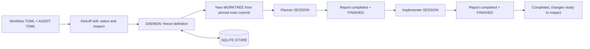

# Ordered AGENT workflows

Start a task from the ROOT WORKTREE on `main`. NEBULA creates one separate WORKTREE and
runs the configured AGENTS in order. [The configuration overview](../.nebula/README.md)
lists the workflows and AGENTS shipped with this checkout.

There are three separate concerns:

| Location | Responsibility |
|---|---|
| `.nebula/workflows/*.toml` | Name, purpose, ordered stages, AGENT selection, and timeout. |
| `.nebula/agents/*.toml` | Reusable provider, MODEL / EFFORT, and role instructions. A stage can also define these inline. |
| SQLITE STORE | Frozen resolved definition, assigned SESSIONS, current stage, and results for each run. |

The initial prototype already accepted different stage lists through `--definition`.
The catalog adds discovery and composition; it feeds the same sequential DAEMON scheduler.
At kickoff, all references and NEBULA defaults resolve into a complete definition. The
DAEMON stores that snapshot, including its filename selector and display name. Edits to
either kind of file affect new runs only, even if a later stage has not started yet.

MAKE DEV's initial database seed removes workflow runs and their SESSION associations,
alongside live SESSIONS. It publishes the seed only after cleanup succeeds; development
instances must never execute copied production workflows.



## Try it

Execution requires a matching binary and DAEMON, PROTOCOL VERSION 40. Older runs still
load from the SQLITE STORE without a schema migration. `catalog` and `inspect` only read
local files and work without a DAEMON. To try execution in a separate development instance:

1. Run the following from this checkout in a separate terminal. These dedicated paths avoid
   stopping an existing MAKE DEV instance for this checkout. Provider authentication and
   hooks still use your normal provider configuration.
2. Add this checkout as a PROJECT if absent, open an AGENT in its ROOT WORKTREE on `main`,
   and invoke `/nebula-workflow reviewed <task>`. The skill is under `.claude/skills` and linked
   into `.agents/skills` for both harnesses.
3. Inspect the new WORKTREE and SESSIONS in the TUI. Read `workflow status <run-id> --json`
   for the task, frozen definition, stage SESSION ids, and stored results.

```sh
make dev SEED=0 \
  DEV_RUNTIME=/tmp/nebula-workflow-prototype \
  DEV_DATA="$HOME/.nebula-dev/workflow-prototype"
```

Inside the development instance, use the absolute path to this checkout's
`target/debug/nebula` if `nebula` on PATH is the older installed release. The worker
STARTING PROMPTS already use the DAEMON executable's absolute, shell-quoted path. The
development runtime/data environment inherited by the SESSION selects the correct instance.
For example, from a kickoff SESSION whose working directory is this checkout:

```sh
./target/debug/nebula workflow start "Document the README setup steps" \
  --workflow default
```

The new WORKTREE starts from the committed `main` revision. Uncommitted changes in the
ROOT WORKTREE, including this prototype's source, are not copied there. The running
DAEMON supplies the workflow instructions and stores the definition, so workers do not
need a copy of the kickoff skill or configuration to participate.

## Watch progress in the TUI

Press **Shift+O** to toggle the WORKFLOWS PANEL, between the WORKTREES PANEL and
SESSIONS PANEL. It is hidden by default; its visibility is saved in the Appearance
SETTING and its width is draggable.

Each row shows the task, PROJECT, workflow definition, status, current step, next
step, and completed/remaining counts. Steps left includes the current unfinished
step. All unfinished runs in the open WORKSPACE appear first, including paused
and blocked runs, followed by the ten newest completed runs.

The FOOTER shows `◆ N running · ⇧O` while this WORKSPACE has workflows or the
panel is open. Creating, running, and waiting runs count as active; paused,
blocked, and completed runs do not. Click the count to open the panel.
Use ↑/↓ to select a run and preview its WORKTREE/SESSION; Enter moves to the
SESSIONS PANEL. Background progress updates do not move FOCUS or switch your SESSION.

MANAGED WORKFLOW worktrees carry a ◆ icon and a task label. New branch names use
the task, such as `workflow-fix-login`, with `-2`, `-3` for repeats. Existing
branches stay as they are. Generated SESSION labels show only their stage, such
as `planner`; explicit user renames are preserved. Internal run IDs and recovery
names remain stable in the SQLITE STORE.

The DAEMON streams compact summaries with the initial snapshot and each persisted
transition. This requires PROTOCOL VERSION 41: restart the DEV INSTANCE to load it.
No separate polling process or state files are needed.

## Create a workflow

TOML is the authoring format: explicit sections, comments, and multiline instructions
keep these small configuration files easy to review. It also uses the same syntax as
the repository's Cargo manifests. Legacy JSON remains readable; YAML is not accepted.
The loader uses [`toml::from_str`](https://docs.rs/toml/latest/toml/fn.from_str.html)
with typed, strict deserialization.

Create `.nebula/workflows/feature.toml`:

```toml
version = 1
name = "Feature implementation"
description = "Plan and implement a feature with attention to compatibility."
timeout_seconds = 1800

[[stages]]
id = "plan"
agent = "planner" # .nebula/agents/planner.toml
instructions = "Include compatibility risks in the plan."

[[stages]]
id = "implement"
agent = { kind = "claude", model = "claude-sonnet-5", effort = "medium" }
instructions = """
Implement the plan and run the relevant checks.
Report verification evidence and unresolved issues.
"""
```

The `feature` filename is the stable selector. `name` is an optional display label and
defaults to the filename; changing it does not change the selector. Different files may
share a label. `description` is optional but helps the skill choose between workflows.
The skill honors an explicit selector, otherwise matches descriptions to the task and
asks when plausible choices would change the outcome.

No-selector behavior is deterministic: use `default.toml`, otherwise the sole TOML
definition. With multiple files and no `default.toml`, selection is required. The CLI
never guesses from alphabetical order. Discovery starts in the current directory and
walks up to the checkout root; it does not inherit another repository's `.nebula` folder.

## Define reusable AGENTS

Create `.nebula/agents/planner.toml`, or edit an existing role:

```toml
kind = "claude"
model = "claude-sonnet-5"
effort = "medium"
instructions = """
Investigate the task and write an actionable plan with acceptance criteria,
affected files, and verification steps. Leave product code unchanged.
"""
```

The AGENT filename is the reference (`agent = "planner"`). AGENT files do not inherit
other AGENTS. A stage's `agent` is either that reference or an inline table containing
the same fields. These repository files are separate from the TUI's AGENT PRESETS.

| Field | Resolution |
|---|---|
| `kind` | Required in the referenced or inline AGENT. Supports `claude` and `codex`. |
| `model`, `effort` | Stage override, then AGENT value, then NEBULA default. If still absent, the provider CLI chooses. |
| `instructions` | AGENT instructions followed by stage instructions, separated by a blank line. At least one must supply text. |

For example, put `effort = "high"` alongside a stage's `agent = "planner"` to override
that stage alone. MODEL / EFFORT strings reach the provider unchanged; exact IDs such as
`claude-sonnet-5` pin the selected version. Use `inspect` to see the final configuration.

Workflow and AGENT selectors are lowercase filename slugs of up to 64 characters.
References stay within the AGENT directory; `../`, absolute references, and symlinks
escaping that directory are rejected. Explicit `--definition` paths may be elsewhere,
but standalone files must use inline AGENTS unless located under a `.nebula` directory.

Validation rejects unknown fields, missing AGENTS, duplicate stage ids, unsupported kinds,
empty composed instructions, and bad bounds before contacting the DAEMON. Workflows have
1 to 10 stages, unique stage ids up to 40 characters, and a timeout of 10 to 86,400 seconds
per stage, including feedback time. Composed instructions are limited to 4,000 bytes;
workflow files to 64 KiB and AGENT files to 16 KiB. Provider access and model availability
are checked by the actual provider launch, not by the local preview.

A reviewer rejection blocks the workflow. Automatic review/fix loops and parallel stages
are outside this prototype. All stages share the same WORKTREE and see previous edits;
each receives a fresh SESSION and reads previous results from the SQLITE STORE.

## Commands

The skill is optional: inside a NEBULA AGENT SESSION, call the CLI directly:

```sh
./target/debug/nebula workflow start "Your task" --workflow reviewed
```

Kickoff currently requires `NEBULA_AGENT_ID`. The DAEMON looks up that registered SESSION
to find its PROJECT and WORKTREE, rejects archived or workflow-assigned callers, and
requires the ROOT WORKTREE on `main`. A normal terminal without that SESSION context
cannot start a run yet; there is no standalone PROJECT or repository selector.

`catalog` and `inspect` work in any terminal without a DAEMON. `list`, `status <id>`,
`pause <id>`, and `resume <id>` need the matching DAEMON but no AGENT context. `report`
requires the assigned stage's AGENT SESSION. The initiating AGENT can finish its turn
after kickoff; the DAEMON owns subsequent scheduling.

All accept `--json`. [The complete existing CLI reference](commands.md) covers the rest
of NEBULA; every visible command and subcommand also has its own `--help` page.

| Command | Behavior |
|---|---|
| `workflow catalog` | List this checkout's definitions, descriptions, stage order, and validation errors. Local read only. |
| `workflow inspect [selector]` | Preview resolved AGENTS, source files, exact MODEL / EFFORT, and composed instructions. Supports `--definition`. Local read only. |
| `workflow start "task" --workflow selector` | Create a WORKTREE from `main`, freeze the definition, queue the first AGENT. Supports `--task-file` for task input and `--definition` for an explicit configuration path. Requires a kickoff SESSION in the ROOT WORKTREE. |
| `workflow status [id]` | Read one run; omitted id selects the caller's assigned workflow. JSON includes full artifacts. |
| `workflow list` | Show runs across this DAEMON, most recently updated first. |
| `workflow report --stage ID --outcome completed --file FILE --summary TEXT` | Store the current assigned AGENT's result and a copy of its Markdown file, maximum 64 KiB. |
| `workflow report --stage ID --outcome blocked --summary TEXT` | Record a blocker; an artifact is optional. |
| `workflow pause ID` | Stop scheduling; leave the current SESSION running. |
| `workflow resume ID` | Continue a paused/blocked run after resolving the cause; renew the stage timeout. |

`catalog --json` returns an array; `inspect --json` returns the source path, description,
AGENT source paths, and resolved definition. Run command replies are `{"Run": {...}}` or
`{"List": [...]}`. These are prototype interfaces.
The commands operate through the same local IPC trust boundary as other NEBULA commands.
Caller SESSION ids identify assignments; they are not a security boundary against another
process running as the same local user.

## Legacy JSON

Existing flat stage definitions still load through `--definition path/to/workflow.json`.
If no TOML definitions exist, the old `.nebula/workflow.json` is also the default and
appears as `legacy` in the catalog. Use its explicit path rather than `--workflow legacy`.
When TOML files exist they take precedence. This checkout's former JSON file was replaced
by `workflows/default.toml` plus reusable AGENTS, preserving its two-stage sequence.

## State and recovery

MIGRATION 24 adds `workflow_runs` and `workflow_sessions` to the existing SQLITE STORE.
The first holds a complete JSON snapshot plus indexed active/update fields. The second
maps each assigned SESSION to exactly one run. One SQLite transaction writes both, so
an association conflict rolls back the complete checkpoint. Artifacts are stored as text
inside the snapshot, not as paths that disappear with a WORKTREE.

The DAEMON watcher runs every two seconds. A mutex serializes workflow commands and
watcher transitions. It records WORKTREE creation intent and stage launch intent before
external work, then records the resulting ids. Run states are `creating`, `running`,
`waiting`, `paused`, `blocked`, and `completed`; stage states are `pending`, `launching`,
`running`, and `completed`.

| Situation | Result and recovery |
|---|---|
| SESSION becomes FINISHED without a report | Wait for an explicit result; timeout eventually blocks. |
| AGENT reports completed while still RUNNING | Store the report and wait for FINISHED before handoff. |
| AGENT needs permissions or feedback | Show `waiting`; resolve the prompt in that SESSION. Normal provider permission behavior is preserved. |
| AGENT reports blocked | Stop scheduling. Resolve it in the same SESSION, replace its blocked report with completed, finish the turn, and resume. |
| DAEMON restarts during active work | Preserve ids, definition, and artifacts. A stopped SESSION blocks; reopen the existing SESSION in the TUI, inspect its task with status, continue it, and resume. |
| Restart after a completed report and FINISHED | That durable completion can advance without recreating the prior SESSION. |
| Crash during stage launch | Adopt the unique SESSION matching the recorded run/stage name. Zero or multiple matches block for inspection; no automatic replacement is launched. |
| Crash during WORKTREE creation | Keep the recorded branch/base and block for inspection; do not blindly retry creation. |
| WORKTREE or SESSION deleted, archived, relocated, or unavailable | Block with the specific cause. Historical results survive ordinary entity deletion. |

The watcher resumes scheduling after a DAEMON restart; it does not automatically resume
an interrupted provider conversation. This avoids duplicate implementation work when
completion is uncertain. A pause is a scheduling control, not a kill switch. Completed
reports are immutable; a duplicate report is accepted while that stage is still current.
No workflow automatically commits, merges, deploys, or deletes the resulting WORKTREE.

## What NEBULA already provided

The DAEMON already owned PTYs, the SQLITE STORE, WORKTREE creation, SESSION creation,
provider-specific MODEL / EFFORT arguments, STARTING PROMPTS, and status hooks. The TUI
is a client and can close while the DAEMON continues.

`nebula worktree` relocates the caller's existing SESSION. `nebula spawn` starts a sibling
in that SESSION's current WORKTREE. Neither exposed an ordered durable workflow, so this
prototype adds workflow IPC/CLI commands and a small DAEMON scheduler around the existing
creation paths. It does not create another process manager or write SQLite from a skill.

The source entry points are `nebula/src/cli.rs`, `nebula/src/workflow_cli.rs`,
`nebula/src/workflow_config.rs`, `nebula/src/workflow_config/format.rs`,
`nebula-core/src/workflow.rs`, `nebula-daemon/src/workflow.rs`,
`nebula-daemon/src/workflow/watcher.rs`, and `nebula-daemon/src/store/workflows.rs`.

## Verification

The focused tests use a real isolated DAEMON, SQLite database, git WORKTREE, and PTYs with
STUB AGENTS. They exercise command submission, explicit-result gating, incorrect caller
rejection, pause/resume, durable results, DAEMON restart, and reuse of the original SESSION.
Named workflow coverage changes/deletes the source files after kickoff and verifies later
stages still use the frozen configuration. Local CLI checks cover catalog/inspect without
a DAEMON, and persistence tests load snapshots created before workflow names existed.
They do not establish that a real provider will follow every instruction without feedback.

```sh
cargo test -p nebula-daemon workflow --lib
cargo test -p nebula workflow_config
cargo test -p nebula --test help_cli
cargo test -p nebula --test e2e_pty workflow_cli_handoffs
```
